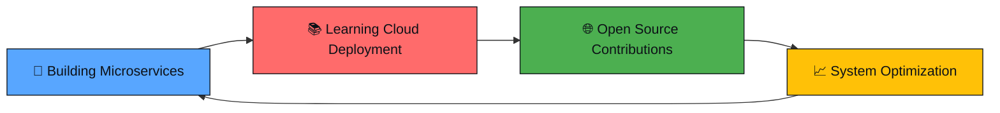

  
# Hi there! I'm Elyor 👋

  
  

---

## 🚀 About Me

- 🔭 I'm currently working on **Python Backend Development**
- 🌱 I'm currently learning **Advanced Python, FastAPI, Django**
- 👯 I'm looking to collaborate on **Backend Projects & APIs**
- 💬 Ask me about **Python, Backend Development, Databases**
- 📫 How to reach me: **salimoff755@gmail.com**
- ⚡ Fun fact: I love building scalable backend systems!

 

---

## 🛠️ Tech Stack & Tools

### 💻 Programming Languages

### 🚀 Frameworks & Libraries

### 🗄️ Databases

### 🛠️ Tools & Platforms

---

## 📊 GitHub Analytics

  
  

  

---

## 🏆 GitHub Trophies

  

---

## 🔥 Featured Projects

### 🦠 **Gut Health Backend API**
*A comprehensive Python backend service for tracking and managing gut health*

**Features:** Health tracking • Nutrition management • Personalized recommendations

---

### 📊 **Data Analytics Dashboard**
*Backend API for data visualization and analytics*

**Features:** Real-time data processing • RESTful APIs • Performance optimization

---

## 💻 Currently Working On

```mermaid
graph LR
    A[🔨 Building Microservices] --> B[📚 Learning Cloud Deployment]
    B --> C[🌐 Open Source Contributions]
    C --> D[📈 System Optimization]
    D --> A
    style A fill:#58A6FF,stroke:#0D1117,color:#0D1117
    style B fill:#FF6B6B,stroke:#0D1117,color:#0D1117
    style C fill:#4CAF50,stroke:#0D1117,color:#0D1117
    style D fill:#FFC107,stroke:#0D1117,color:#0D1117
```

- 🔨 Building scalable microservices with **Python**
- 📚 Learning cloud deployment (**AWS**, **Docker**)
- 🌐 Contributing to **open-source projects**
- 📈 Improving **system performance** and optimization

---

## 🤝 Let's Connect!

---

  
### 💡 *"First, solve the problem. Then, write the code."* – John Johnson

